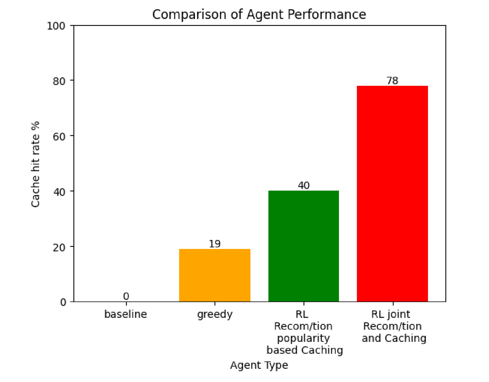

# Optimizing Network-Friendly Recommendations and Caching Jointly, Using Reinforcement Learning

Diploma thesis, School of Electrical and Computer Engineering, Technical University of Crete (2025)
**Alexandros Alogoskoufis** · Committee: Prof. Thrasyvoulos Spyropoulos, Prof. Georgios Chalkiadakis, Prof. Michael Lagoudakis

Recommend a user the perfect next video — except it isn't in the nearby cache, so it has to be pulled from a server hundreds of miles away anyway. Recommendation systems and caching systems are usually built, and optimized, by two teams that never talk to each other. This thesis merges them into one decision: a reinforcement learning agent that picks *what to recommend* and *what to cache* jointly, at every step.

<p align="center">
  
</p>

**Jointly optimizing recommendation and caching nearly doubles the cache hit rate of RL recommendation-only (78% vs. 40%)**, and leaves static heuristics far behind (greedy 19%, no optimization 0%) — measured over 5,000 sessions on a MovieLens-derived, 10,000-item catalogue.


## What this is about

Content delivery networks cache popular content close to users to cut latency; recommendation systems suggest content to keep users engaged. They're almost always optimized separately, which is exactly the problem above.

This thesis formulates joint recommendation-and-caching as a single Markov Decision Process and trains an RL agent (Double DQN, with prioritized experience replay and an attention-based Q-network) to solve it end to end. It's validated at three scales: a tabular Q-learning sanity check on tiny catalogues, medium-scale Tabular-vs-DQN comparisons, and large-scale DQN experiments up to 10,000 items — including a scenario built entirely from real [MovieLens](https://grouplens.org/datasets/movielens/) viewing data. Across all of them, the joint agent beats recommendation-only RL paired with a fixed caching heuristic.

## Repository contents

| File | Description |
|---|---|
| [`Thesis Optimizing Network-friendly Recommendations and Caching jointly, using Reinforcement Learning.pdf`](Thesis%20Optimizing%20Network-friendly%20Recommendations%20and%20Caching%20jointly%2C%20using%20Reinforcement%20Learning.pdf) | The full thesis text |
| [`Optimizing Network-friendly Recommendations and Caching jointly, using Reinforcement Learning.ipynb`](Optimizing%20Network-friendly%20Recommendations%20and%20Caching%20jointly%2C%20using%20Reinforcement%20Learning.ipynb) | The simulator and RL agents (environment, DQN/DDQN implementation, training and evaluation) |

## Running the notebook

The notebook is the submitted code; the only edits since submission are removed dead
cells, cleared outputs and data paths made relative. The figures and numbers are in the
thesis PDF. The MovieLens section expects
`ratings_small.csv` (from the [MovieLens](https://grouplens.org/datasets/movielens/)
"small" release) next to the notebook and builds the similarity matrix and popularity vector from it
(or loads `u_file.npy` / `popularity_file.npy` if present). The synthetic-catalogue
experiments need no external data.

A cleaner, faster re-implementation of the single-edge method, with a redesigned Q-network
and a scripted seed sweep, lives in the follow-up repository `joint-rec-edge-caching`.

## Citation

If you reference this work, please cite:

```
Alogoskoufis, A. (2025) "Optimizing network-friendly recommendations and caching jointly, using reinforcement learning." Available at: https://dias.library.tuc.gr/handle/123456789/25039.
```

## Licence

MIT — see `LICENSE`.
